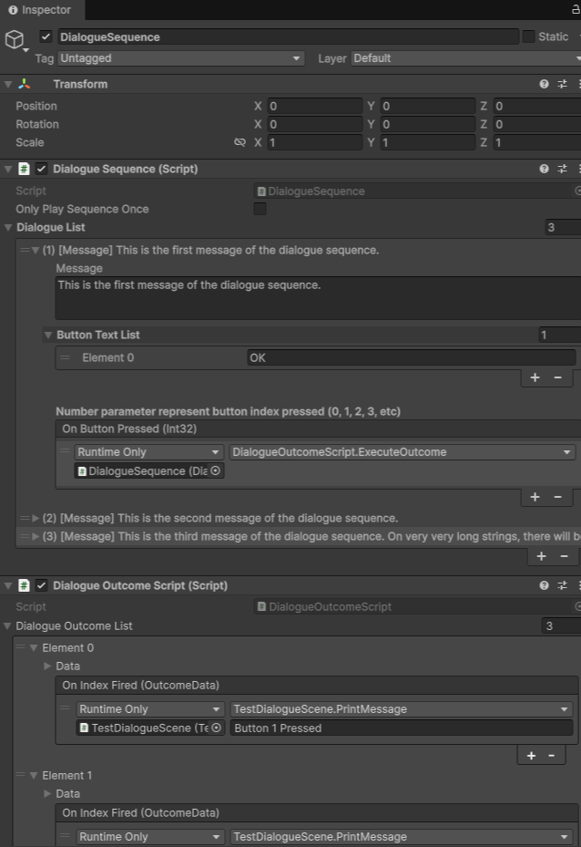
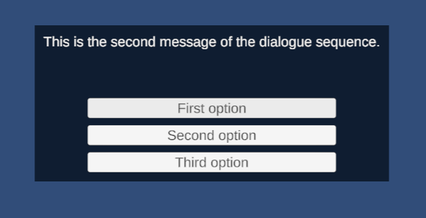
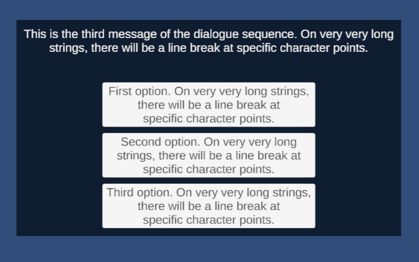

# Dialogue Sequence

A custom Unity Editor tool that allows non-technical users to insert textual information in a component, which will then be processed as a dialogue system for other components to use. A dialogue outcome script is also able to call functions from other scripts.

## Features
- Editable dialogue sequence
- Button option system
- Custom Inspector
- Drag-and-drop UnityEvents

## Screenshots

## How to Use
1. Open the project in Unity 6000.3+
2. Open the 'TestDialogueScene' scene.
3. Select the 'DialogueSequence' game object to view the DialogueSequence and DialogueOutcomeScript component.
4. Change the content in the inspector as needed.
5. Play the scene to preview a use case for the dialogue sequence.

## Technical Highlights
- Uses `UnityEditor` API
- Clean separation between Editor and Runtime code

**Note**: This demo recreates the type of editor tooling I built in professional projects. It shows my current approach to scenario development. Full professional implementations are under NDA.